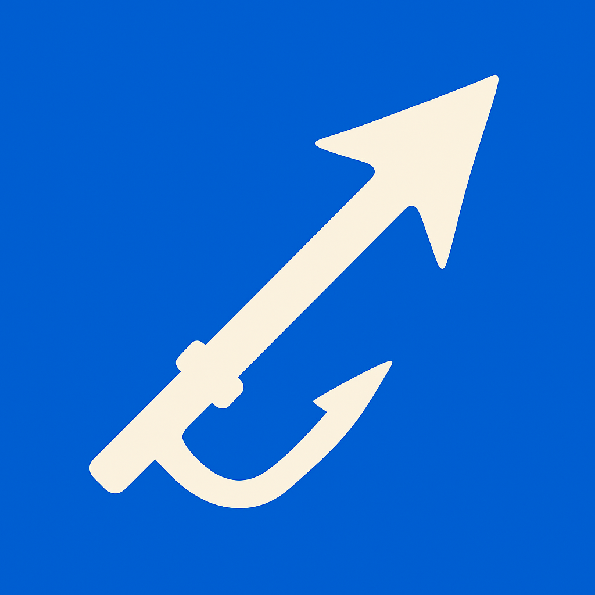

# Hookmark

  

A Chrome extension that brings Harpoon-like tab navigation to your browser. Inspired by [ThePrimeagen's](https://github.com/ThePrimeagen) excellent [Harpoon](https://github.com/ThePrimeagen/harpoon) plugin for Neovim.

## What is Hookmark?

Hookmark allows you to create a quicklist of tabs and jump between them using keyboard shortcuts, just like Harpoon does for files in Neovim. Instead of hunting through dozens of open tabs, you can mark your most important tabs and instantly jump between them.

## Features

- **Quick Tab Management**: Add current tab to your quicklist with `Alt+Shift+H`
- **Instant Navigation**: Jump to quicklist tabs using keyboard shortcuts
- **Persistent Storage**: Your quicklist survives browser restarts
- **Smart Tab Handling**: Automatically reopens closed tabs when you try to jump to them
- **Clean Interface**: Minimal popup UI for managing your quicklist

## Keyboard Shortcuts

### Primary Shortcuts
- `Alt+Shift+H` - Add current tab to quicklist
- `Alt+Shift+O` - Open quicklist popup
- `Alt+Shift+B` - Toggle back to last active tab
- `Alt+Shift+J` - Jump to quicklist tab 1

### Extended Shortcuts
- `Alt+Shift+K` - Jump to tab 2
- `Alt+Shift+L` - Jump to tab 3
- `Alt+Shift+:` - Jump to tab 4
- `Alt+Shift+1` through `Alt+Shift+9` - Jump to tabs 1-9 using symbol keys

### Popup Navigation
- `j/k` or `↑/↓` - Navigate quicklist
- `Enter` - Jump to selected tab
- `x/X` - Remove selected tab from quicklist
- `Shift+J/K` - Move tab up/down in list
- `Escape` - Close popup

## Installation

1. Download or clone this repository
2. Open Chrome and navigate to `chrome://extensions/`
3. Enable "Developer mode" in the top right
4. Click "Load unpacked" and select the extension directory
5. The extension will automatically inject into all existing tabs to ensure it works on installation

## Why Hookmark?

If you're a developer who uses Harpoon in Neovim, you know how powerful it is to have instant access to your most important files. Hookmark brings that same workflow to your browser tabs. No more `Ctrl+Tab` cycling through dozens of tabs - just quick, direct navigation to what matters.

## Credits

Huge thanks to [ThePrimeagen](https://github.com/ThePrimeagen) for creating [Harpoon](https://github.com/ThePrimeagen/harpoon) and inspiring this browser extension. If you're a Neovim user and haven't tried Harpoon yet, you're missing out!

## License

MIT License - feel free to fork, modify, and improve!
